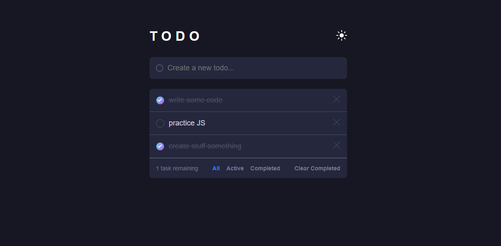

# Todo app 

## Overview

Users should be able to:

- View the optimal layout for the app depending on their device's screen size
- See hover states for all interactive elements on the page
- Add new todos to the list
- Mark todos as complete
- Delete todos from the list
- Filter by all/active/complete todos
- Clear all completed todos
- Toggle light and dark mode

### Screenshot

### Links

- Live Site URL: [View Live Demo](https://todo-app-drab-zeta-54.vercel.app)

## My process

A large part of this project was made with functional programming and DOM manipulations, I also implemented a little bit of OOP in creating the task lists, and this was so that i could easily track the number of active tasks by storing them in an array. And also so that I could easily give each task {object} it's own unique properties and identity.

### Built with

- Semantic HTML5 markup
- CSS custom properties
- Flexbox
- Mobile-first workflow
- Vanilla Js